# Servidor Wordpress (docker) + Amazon EC2 + Amazon RDS + CloudWatch

## #Objetivo do Projeto
Criar uma VPC e instâncias EC2 Ubuntu, instalar o docker e subir containers do Wordpress nas instâncias usando o RDS (como banco de dados), montar um diretório com Amazon EFS para usar como volume do container, criar um Auto-Scaling Group (para criar ou remover instâncias conforme o tráfego), um Load Balancer (para distribuir o tráfego entre os servidores), e configurar o Amazon CloudWatch para monitorar as intâncias EC2.

## #Tecnologias utilizadas
> É necessário possuir: uma conta na Amazon AWS e no Discord e o VSCODE instalado na máquina.

- Sistema Operacional da máquina utilizado durante o projeto: Windows 11.
- Recursos Amazon AWS: VPC, Security Group, Subnets, Key Pair, Instance EC2 (Amazon Linux 2023 AMI, t2.micro), RDS, CloudWatch.
- Docker e Docker Compose (coloca a versão aqui depois).
- VSCode (GitBash - terminal).

### 1. Criando um container Wordpress local
> Para esse laboratório, já foram previamente instalados: Docker Desktop (v4.39.0) - com o  integração do WSL habilitada, WSL (v2.4.11.0) - com um subsistema Ubuntu (v24.04).

* Abrir o terminal do Ubuntu e digitar:

<a href="local/docker-compose.yml">docker-compose</a>

<a href="local/.env">env</a>

```
sudo su -
(inserir sua senha de root)
apt update && apt upgrade -y
cd /
mkdir wordpress && cd wordpress
mkdir compose && cd compose
vi docker-compose.yml
(colar código docker-compose.yml aqui, salvar e sair)
vi .env
(colar código .env aqui, salvar e sair)
docker-compose up -d
```

*Acessar http://ip_maquina_linux:8080 no navegador para acessar o wordpress.
> Para vizualizar o ip da sua máquina, execute o comando: ip a (copiar o ip do tipo "BROADCAST,MULTICAST,UP" - geralmente o nome da interface é ***eth0***).

</img>

### 2. Criando a VPC 

2.1 Procurar e selecionar ***VPC*** no console da Amazon AWS.
> A Amazon Virtual Private Cloud (VPC) é uma rede virtual isolada que possibilita usar recursos AWS nela, como as instâncias EC2.


2.2 Selecionar ***Create VPC***.


2.3 Selecionar ***VPC and More***; habilitar Auto-generate e inserir o nome de sua VPC; Number of public subnets: 2 (quantidade de subnets públicas da VPC); Number of private subnets: 2 (quantidade de subnets privadas da VPC); selecionar Create VPC.
> As demais configurações não alteramos.


> O security group define o tráfego dos nossos recursos AWS (quem e quais conexões e portas são permitidas, similiar a um firewall).

### 3. Criando o Security Group das instâncias EC2 e da instância RDS(MySQL)
> O security group define o tráfego dos nossos recursos AWS (quem e quais conexões e portas são permitidas, similiar a um firewall).

3.1 Criando e configurando o Security Group das instâncias.

3.2 Procurar e selecionar ***EC2*** no console da AWS.


3.3 Selecionar ***Security Groups***. 


3.4 Selecionar ***Create security group***.


3.5 Informar o nome do seu Security Group em Security group name; inserir a descrição do seu Security Group em Description; selecionar a VPC que foi criada anteriormente.


3.6 Selecionar ***Delete*** (Outbound Rules).


3.7 Selecionar ***Create security group***.


3.8 Selecionar: ***Inbound rules***; ***Edit Inbound Rules***.


3.8 Selecionar ***Add rule***, e inserir:Inserir: Type: SSH; Source: My IP; Description: a descrição da sua regra SSH.
> Essa regra de entrada vai permitir o acesso (apenas para a nossa máquina) da instância EC2 Amazon Linux que criarmos pelo VSCode (usando uma par de chaves). 

3.9 Selecionar ***Add rule***, e inserir: Type: Custom TCP; Port: 8080; Source: Anywhere-IPv4; Description: a descrição da sua regra HTTP.
> Essa regra de entrada vai permitir a conexão de qualquer máquina com a instância EC2 Amazon Linux que criarmos pelo VSCode (isso possibilitará o acesso de outras máquinas a página do Wordpress).

3.10 Selecionar ***Save rules***.


3.11 Selecionar: ***Outbound rules***; ***Edit Outbound Rules***.


3.12 Selecionar ***Add rule***, e inserir: Type: All traffic; Destination: Anywhere-IPv4; Description: a descrição da sua regra de saída.
> Essa regra de saída vai permitir que a instância EC2 que criaremos realizar qualquer tipo de conexão com IPs da versão 4 (vai permitir o acesso de internet para a instância e o acesso com a instância RDS que criaremos (MySQL)).

3.13 Selecionar ***Save rules***.

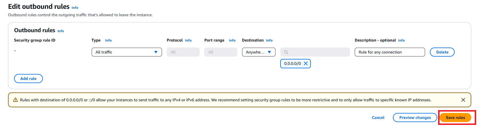

3.14 Selecionar ***Create security group***.
> Agora iremos criar o security group do MySQL.


3.15 Informar o nome do seu Security Group em Security group name; inserir a descrição do seu Security Group em Description; selecionar a VPC que foi criada anteriormente.

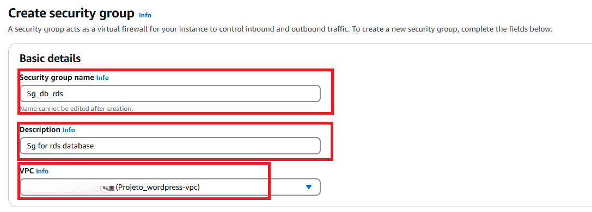

3.16 Selecionar ***Delete*** (Outbound Rules).


3.17 Selecionar ***Create security group***.


3.18 Selecionar: ***Inbound rules***; ***Edit Inbound Rules***.


3.19 Selecionar ***Add rule***, e inserir:Inserir: Type: MYSQL/Aurora; Source: Custom - selecionar o security group das intâncias EC2; Description: a descrição da sua regra SSH.
> Essa regra de entrada vai permitir o acesso das instâncias Wordpress com a instâncias RDS(banco de dados) que criaremos.

3.20 Selecionar ***Save rules***.

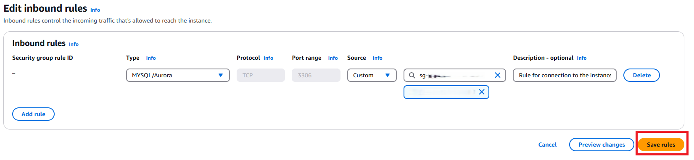

### 4. Criando a instância RDS
> O Amazon Relational Database Service (Amazon RDS) é um serviço da Web que facilita a configuração, a operação e escalabilidade de um banco de dados relacional na Nuvem AWS.

4.1 Procurar e selecionar ***RDS*** no console da AWS.

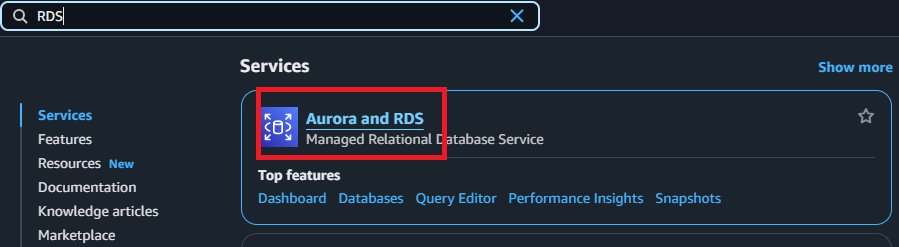</img>

4.2 Selecionar ***Databases*** e ***Create database***.

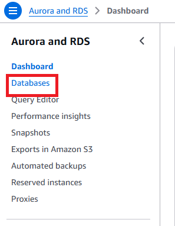</img>

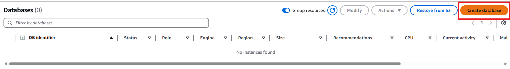</img>

4.3 Selecionar ***Standard create*** e ***MySQL***.

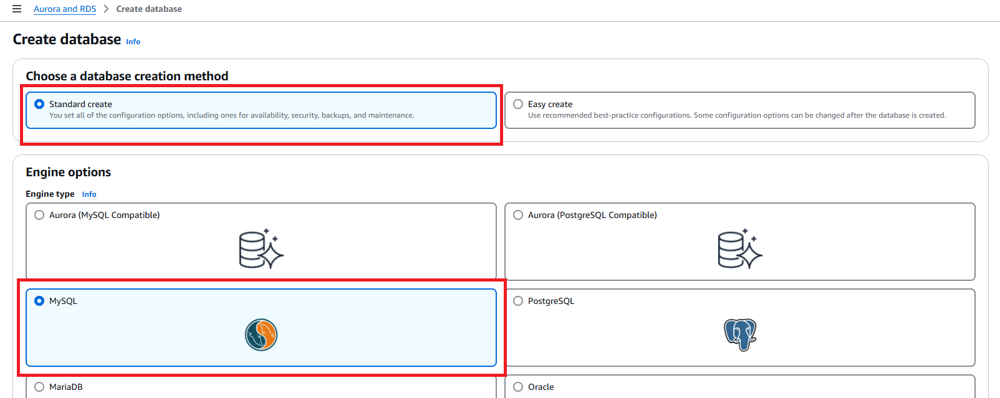</img>

4.4 Selecionar ***Free tier*** e ***Single-AZ DB instance deployment (1 instance)***.

</img>

4.5 Inserir o nome da instância RDS e nome do usuário do banco; selecionar ***Self managed***; inserir senha do usuário (a senha não pode conter caracteres especiais) e redigitá-la.
> Guarde as credenciais do usuário em um local seguro.

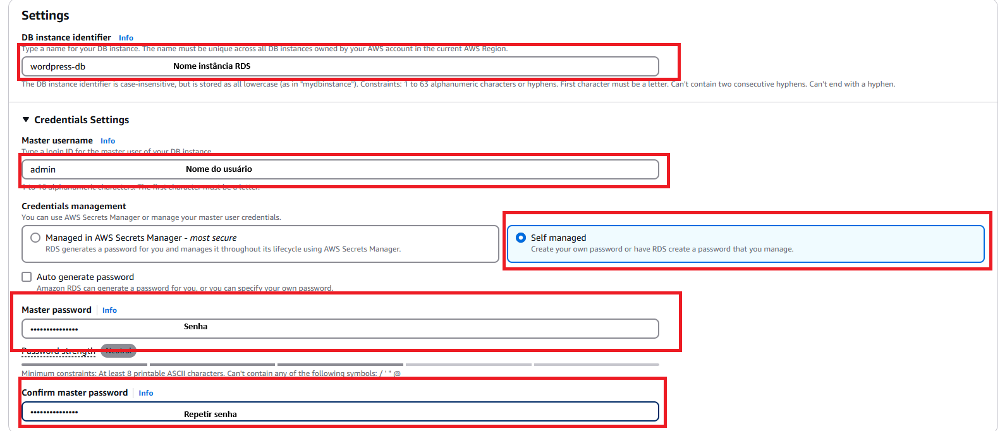</img>

4.6 Selecionar ***db.t3.micro*** e inserir 20 (Allocated Storage).

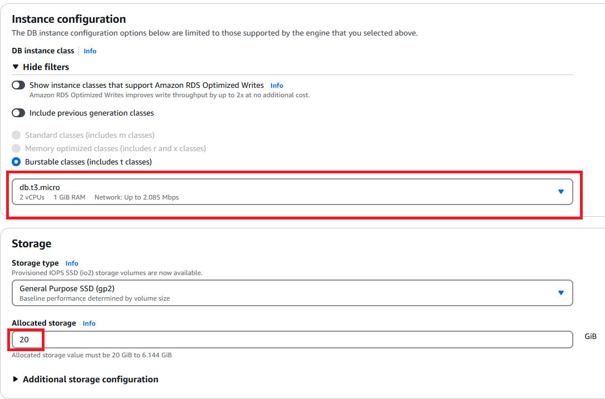</img>

4.7 Selecionar ***Additional storage configuration***; desabilitar ***Enable storage autoscaling***; selecionar: ***Don’t connect to an EC2 compute resource***, a vpc que criamos e ***No***(Public access).

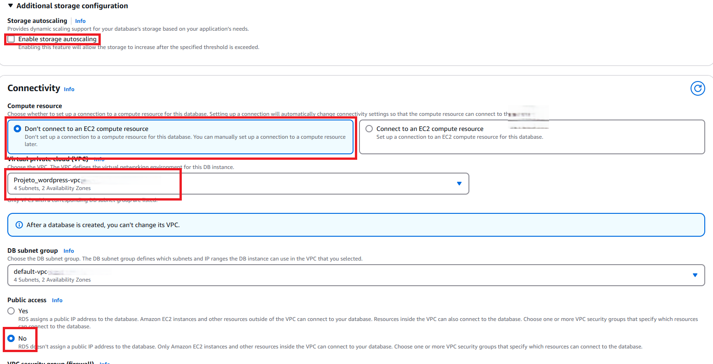</img>

4.8 Selecionar: ***Choose existing***; o security group do database que foi criado (apenas ele deve estar habilitado); e ***No preference***(Availability Zone). 

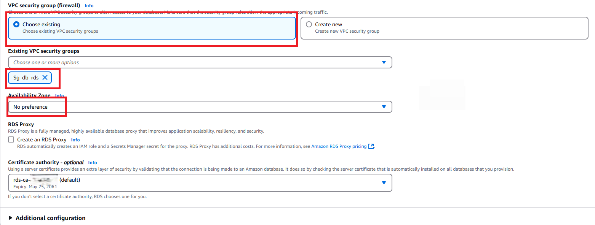</img>

4.9 Selecionar ***Password authentication*** e ***Database Insights - Standard***.

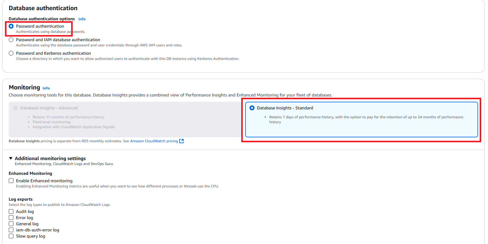</img>

4.10 Selecionar ***Additional configuration***; inserir nome do banco de dados; desabilitar ***Enable automated backups***, habilitar ***Enable auto minor version upgrade***.

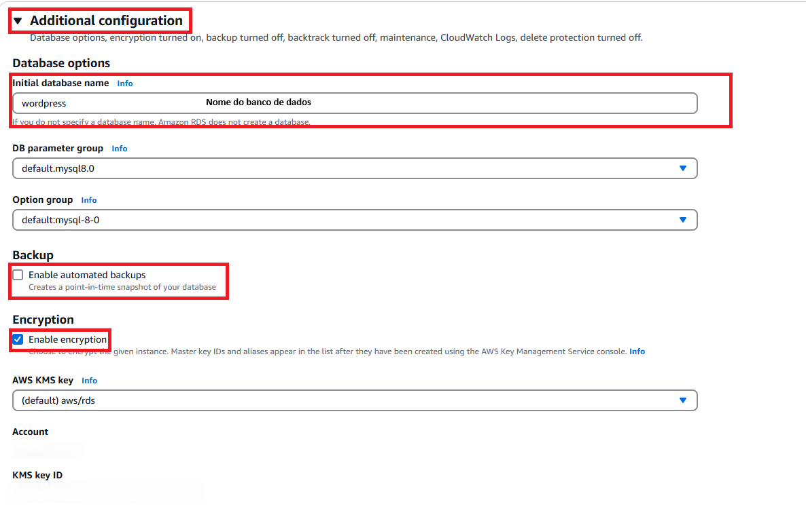</img>

4.11 Desabilitar ***Enable auto minor version upgrade*** e ***Enable deletion protection***; selecionar ***No preference*** e ***Create database***.

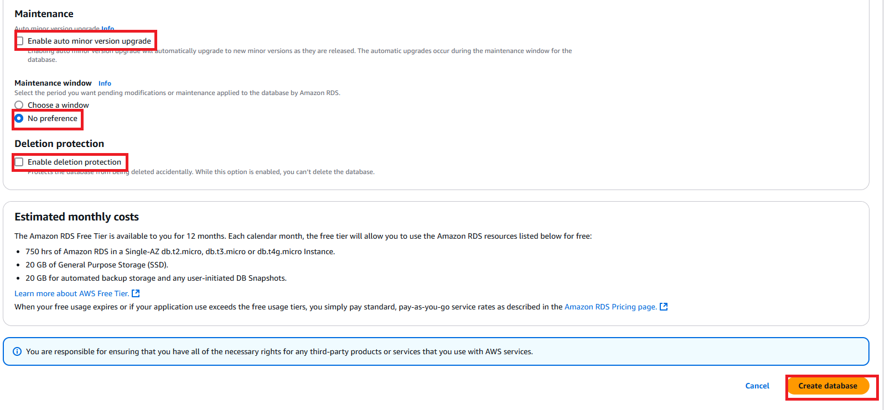</img>

4.12 Selecionar ***Close***.

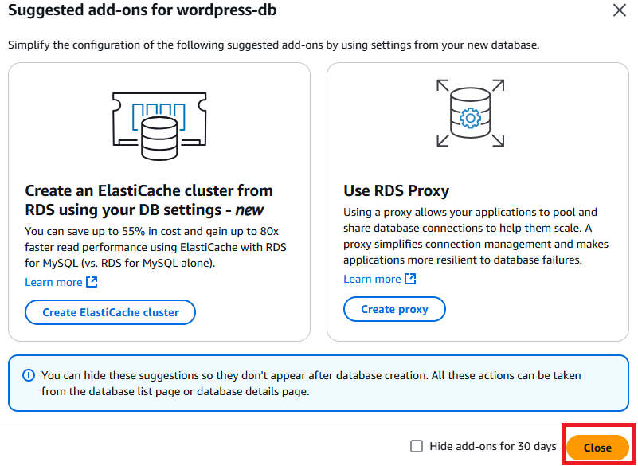</img>

4.13 Selecionar a instância RDS.
> O status da instância precisa ser igual a "Available" (é necessário aguardar alguns minutos e selecionar o botão "Refresh" para atualizar a página).

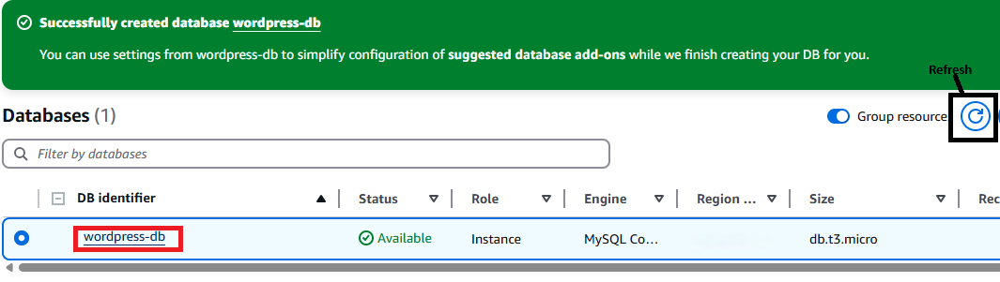</img>

4.14 Selecionar ***Connectivity & security*** e copiar o endpoint do banco de dados.
> Usaremos o endereço do endpoint do banco de dados para realizar a conexão entre as instâncias WordPress com o MySQL(dentro da variavel DB_HOST do arquivo "docker-compose.yml").

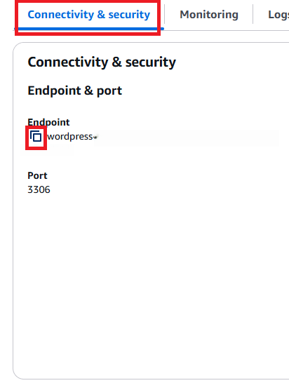</img>

### 5. Criando um sistema de arquivo (EFS)
> O Amazon EFS fornece armazenamento de arquivos escalável para uso com o Amazon EC2. É possível usar um sistema de arquivos de EFS como uma fonte de dados comum para workloads e aplicações em execução em várias instâncias.

5.1 Procurar e selecionar ***EFS*** no console da AWS.

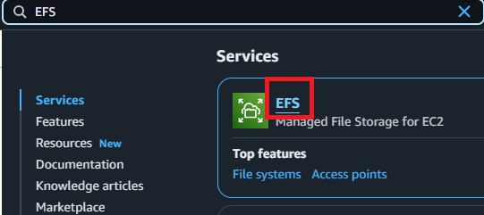</img>

5.2 Selecionar ***Create file system*** e ***Customize***.

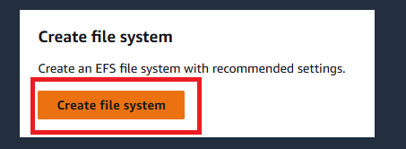</img>

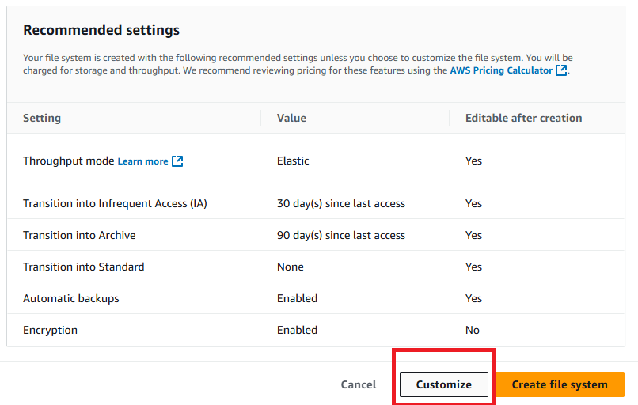</img>

5.3 Inserir nome do sistema de arquivos; selecionar ***Regional***; desabilitar enable automatic backups; selecionar ***None*** (para todas opções do campo Lifecycle management); habilitar ***Enable encryption of data at rest***.  

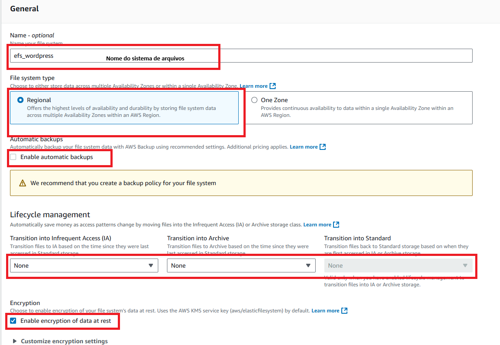</img>

5.4 Selecionar ***Bursting*** e ***Next***.

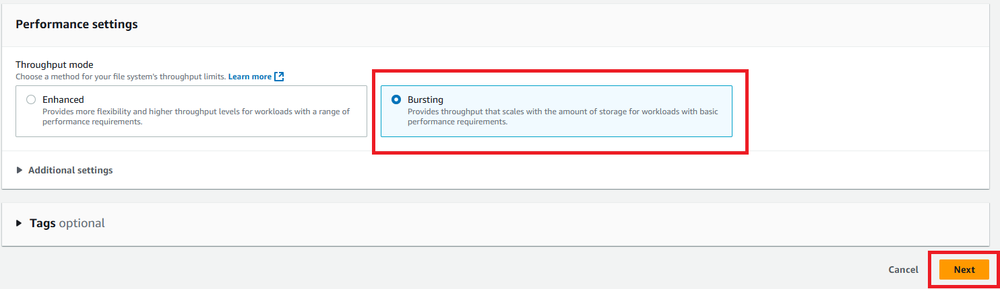</img>

5.5 Selecionar a VPC que criamos.

5.6 Selecionar: Availability zone: 1a; subnet privada 1; e o security group das instâncias Wordpress.

5.7 Selecionar: Availability zone: 1b; subnet privada 2; e o security group das instâncias Wordpress.

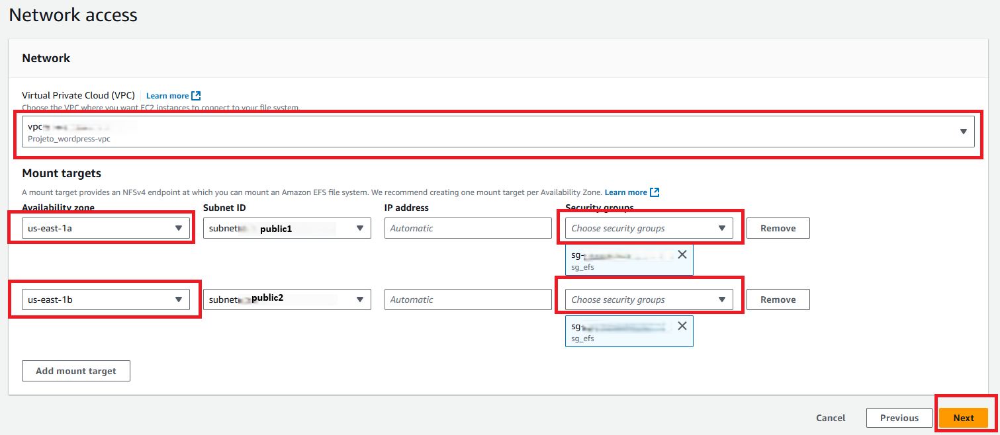</img>

5.8 Selecionar ***Next***, ***Next*** e ***Create***.
> As configurações feitas nos tópicos 5.6 e 5.7 permitirão montarmos o sistema de arquivos dentro das instâncias Wordpress.

5.9 Selecionar o File System criado.
> O status do file system precisa ser igual a "Available" (é necessário aguardar alguns minutos e selecionar o botão "Refresh" para atualizar a página).

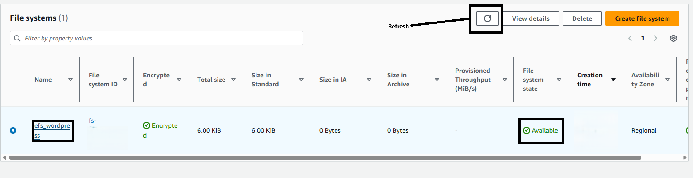</img>

5.10 Selecionar ***Attach***.

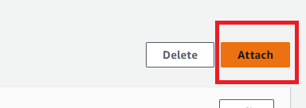</img>

5.11 Selecionar ***Mount via DNS***, copiar o comando (EFS mount helper).
> Esse comando será usado para montar o sistema de arquivos que criamos dentro das instâncias EC2.

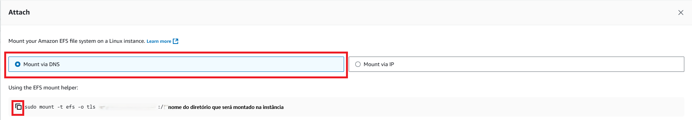</img>

### 6. Criando uma Key Pair (par de chaves)
> Criaremos um par de chave ".pem" para conectar na instância EC2 Amazon Linux pelo VSCode (GitBash) via conexão SSH (conforme a regra do security group).

3.1 Selecionar ***Key Pairs***.
> É necessário estar na página EC2 da Amazon AWS.

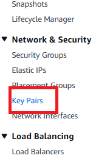

3.2 Selecionar ***Create Key Pair***.

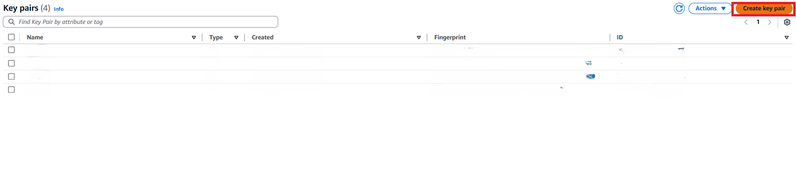

3.3 Inserir o nome do seu par de chaves (Name); selecionar o tipo da chave: RSA (Key pair type); selecionar o formato da chave: .pem (Private key..).

3.4 Selecionar ***Create key pair***.
> Após criar o par de chaves, irá ser feito seu download, se atente ao diretório em que a chave está alocada, pois iremos usar elas no processo de conectar na instância.

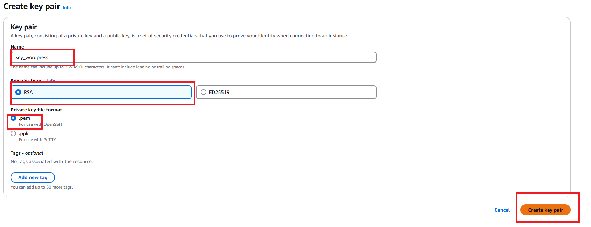

### 7. Criando a instância EC2 Amazon Linux
> Uma instância EC2 é como se fosse uma VM (virtual machine) dentro da Amazon AWS, ou seja, é o seu servidor. Para realizar as configurações abaixo é necessário estar na página ***EC2***.

4.1 Selecionar ***Instances***.

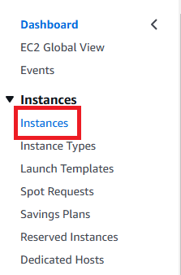

4.2 Selecionar ***Launch Instances***.
> As configurações de: AMI (Sistema Operacional) e sua versão; tipo de instância; tamanho do volume EBS (armazenamento) e seu tipo  foram escolhidas as opções "Free Tier eligible" (são gratuitas). Porém o uso da instância ao longo do tempo é cobrado, após a prática do projeto a instância foi deletada ("Terminate Instance").

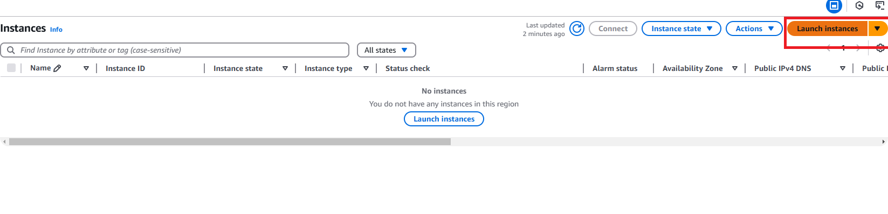

4.3 Infomar o nome da instância (Name), e selecionar: Quick Start: Amazon Linux (é o sistema operacional do servidor); AMI: Amazon Linux AMI; Architeture: 64 bits ou 32 bits (conforme a configuração da sua máquina); Instance Type: t2.micro (é o tipo da instância); Key pair: a chave que você criou.

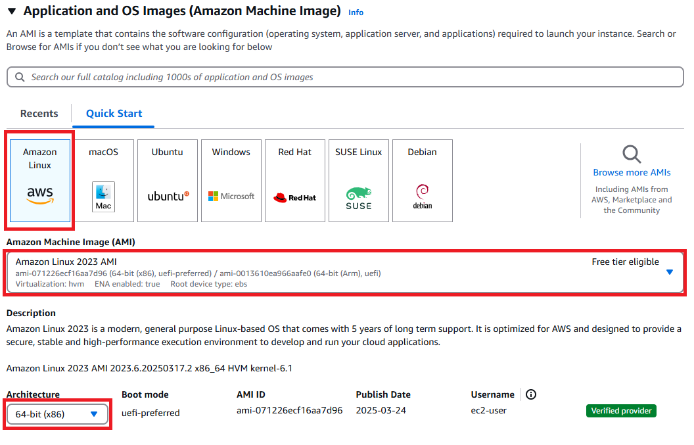
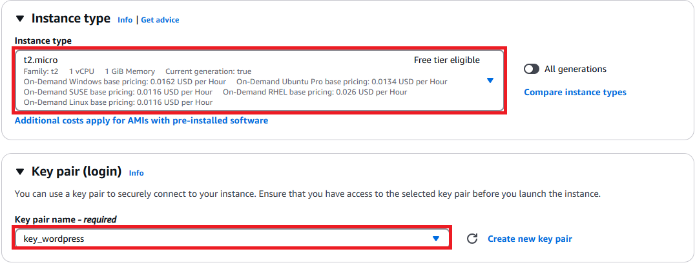
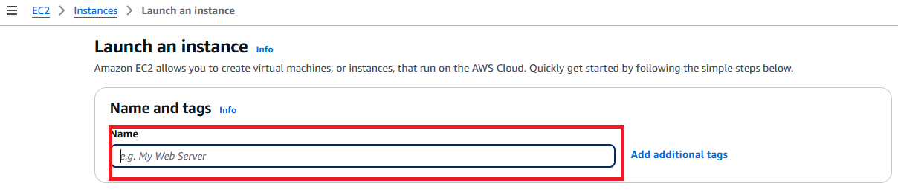

4.4 Selecionar ***Edit*** (Network settings).

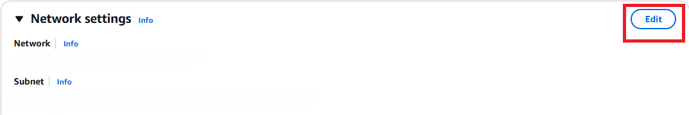

4.5 Selecionar: VPC: VPC criada; Subnet: qualquer subnet pública; Auto-assign public IP: Enable (a intância vai possuir um IP público e isso vai permitir que qualquer ip consiga acessar a página do Wordpress).

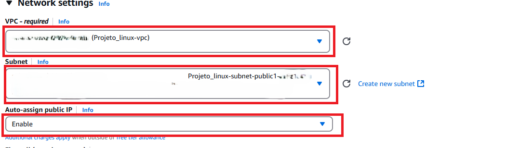

4.6 Selecionar ***Select existing security group***.

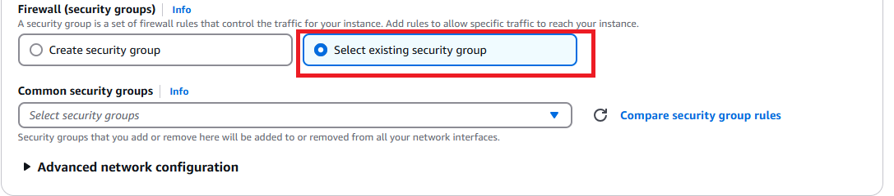

4.7 Selecionar o security group criado anteriormente (Commom security groups).

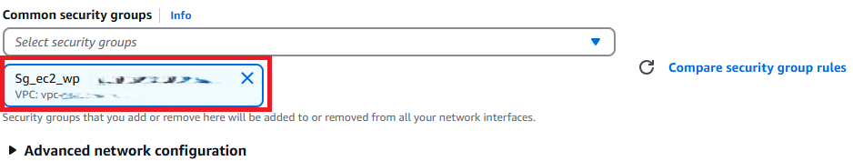

4.8 Inserir o tamanho em GB do armazanemento do seu servidor (1x) e tipo dele (gp3).

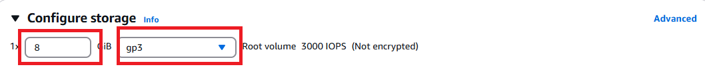

4.10 Selecionar ***Launch instance***.

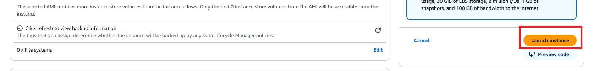

(criar security group do rds e depois o rds, depois o efs e associar as subnets publicas (que estao as instancias) depois criar a instancia)