# Servidor Wordpress (docker) + Amazon EC2 + Amazon RDS + CloudWatch

## #Objetivo do Projeto
Criar uma VPC e instâncias EC2 Ubuntu, instalar o docker e subir containers do Wordpress nas instâncias usando o RDS (como banco de dados), montar um diretório com Amazon EFS para usar como volume do container, criar um Auto-Scaling Group (para criar ou remover instâncias conforme o tráfego), um Load Balancer (para distribuir o tráfego entre os servidores), e configurar o Amazon CloudWatch para monitorar as intâncias EC2.

## #Tecnologias utilizadas
> É necessário possuir uma conta na Amazon AWS e no Discord, ter noções básicas de HTML e possuir o VSCODE instalado na máquina.

- Sistema Operacional da máquina utilizado durante o projeto: Windows 11.
- Recursos Amazon AWS: VPC, Security Group, Subnets, Key Pair, Instance EC2 (Amazon Linux 2023 AMI, t2.micro), RDS, CloudWatch.
- Docker e Docker Compose (coloca a versão aqui depois).
- VSCode (GitBash - terminal).

### 1. Criando um container Wordpress local
> Para esse laboratório, já foram previamente instalados: Docker Desktop (v4.39.0) - com o  integração do WSL habilitada, WSL (v2.4.11.0) - com um subsistema Ubuntu (v24.04).

* Abrir o terminal do Ubuntu e digitar:

<a href="local/docker-compose.yml">docker-compose</a>
<a href="local/.env">env</a>

```
sudo su -
(inserir sua senha de root)
apt update && apt upgrade -y
cd /
mkdir wordpress && cd wordpress
mkdir compose && cd compose
vi docker-compose.yml
(colar código docker-compose.yml aqui, salvar e sair)
vi .env
(colar código .env aqui, salvar e sair)
docker-compose up -d
```

*Acessar http://ip_maquina_linux:8080 no navegador para acessar o wordpress.
> Para vizualizar o ip da sua máquina, execute o comando: ip a (copiar o ip do tipo "BROADCAST,MULTICAST,UP" - geralmente o nome da interface é ***eth0***).

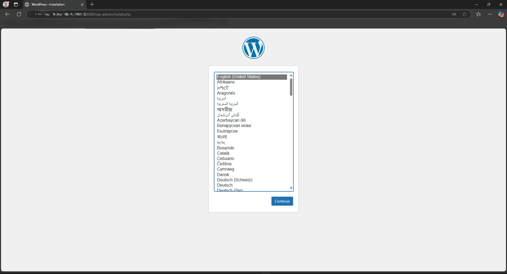</img>

### 2. Criando uma VPC, e uma instância EC2 

2.1 Procurar e selecionar ***VPC*** no console da Amazon AWS.
> A Amazon Virtual Private Cloud (VPC) é uma rede virtual isolada que possibilita usar recursos AWS nela, como as instâncias EC2.

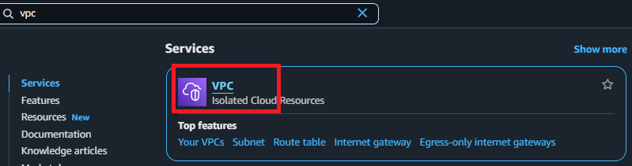

2.2 Selecionar ***Create VPC***.

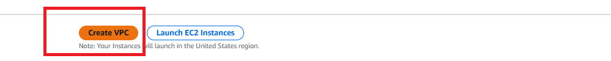

2.3 Selecionar ***VPC and More***; habilitar Auto-generate e inserir o nome de sua VPC; Number of public subnets: 2 (quantidade de subnets públicas da VPC); Number of private subnets: 2 (quantidade de subnets privadas da VPC); selecionar Create VPC.
> As demais configurações não alteramos.

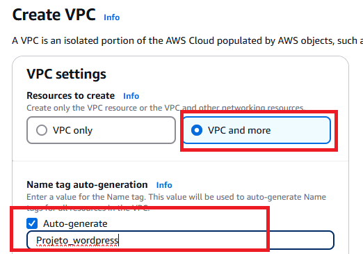

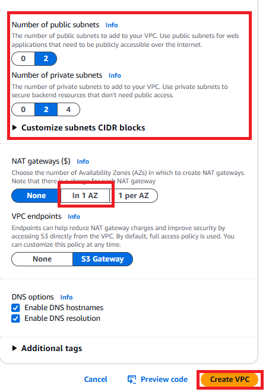

> O security group define o tráfego dos nossos recursos AWS (quem e quais conexões e portas são permitidas, similiar a um firewall).

2.4 Criando e configurando o Security Group das instâncias

2.5 Procurar e selecionar ***EC2*** no console da AWS.

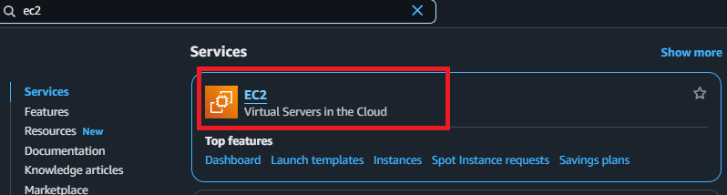

2.6 Selecionar ***Security Groups***. 

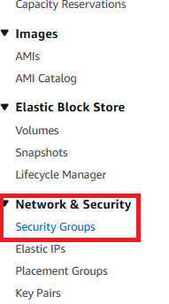

2.7 Selecionar ***Create security group***.

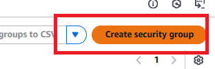

2.8 Informar o nome do seu Security Goup em Security group name; inserir a descrição do seu Security Group em Description; selecionar a VPC que foi criada anteriormente.

 mudar img

2.9 Selecionar ***Delete*** (Outbound Rules).

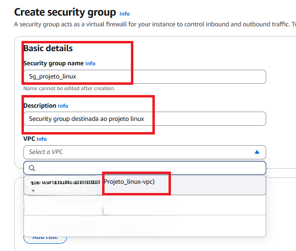

2.10 Selecionar ***Create security group***.

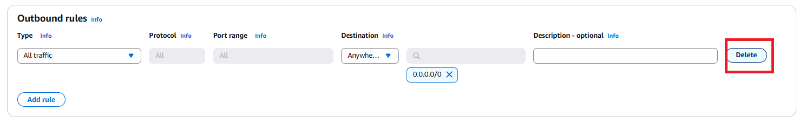

2.11 Selecionar: ***Inbound rules***; ***Edit Inbound Rules***.

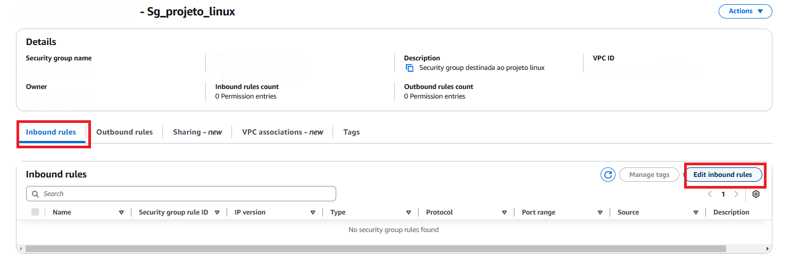

2.12 Selecionar ***Add rule***, e inserir:Inserir: Type: SSH; Source: My IP; Description: a descrição da sua regra SSH.
> Essa regra de entrada vai permitir o acesso (apenas para a nossa marquina) da instância EC2 Amazon Linux que criarmos pelo VSCode (usando uma par de chaves). 

2.13 Selecionar ***Add rule***, e inserir: Type: Custom TCP; Port: 8080; Source: Anywhere-IPv4; Description: a descrição da sua regra HTTP.
> Essa regra de entrada vai permitir a conexão de qualquer máquina com a instância EC2 Amazon Linux que criarmos pelo VSCode (isso possibilitará o acesso de outras máquinas a página do Wordpress).

2.14 Selecionar ***Save rules***.

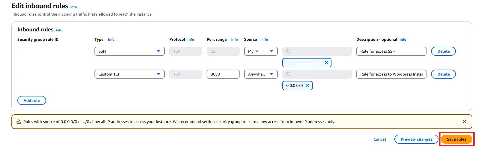

2.12 Selecionar: ***Outbound rules***; ***Edit Outbound Rules***.

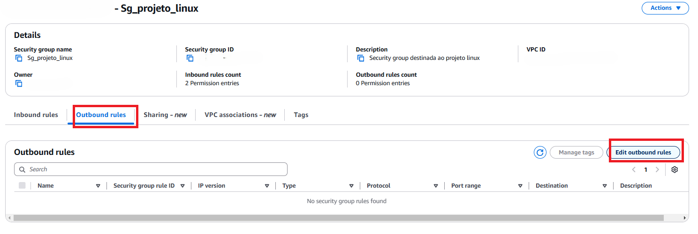

2.13 Selecionar ***Add rule***, e inserir: Type: All traffic; Destination: Anywhere-IPv4; Description: a descrição da sua regra de saída.
> Essa regra de saída vai permitir que a instância EC2 que criaremos realizar qualquer tipo de conexão com IPs da versão 4 (vai permitir o acesso de internet para a instância).


2.14 Selecionar ***Save rules***.