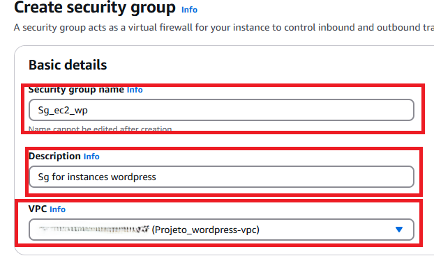
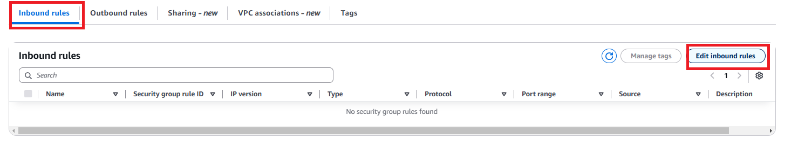
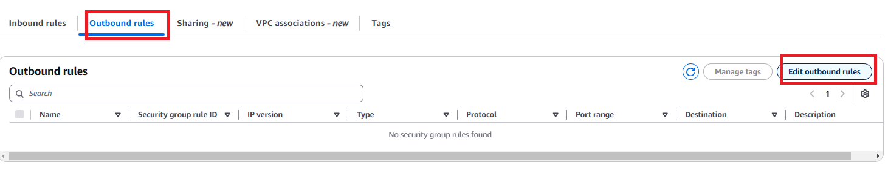
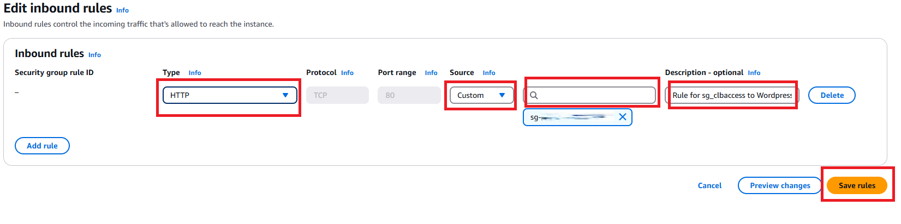
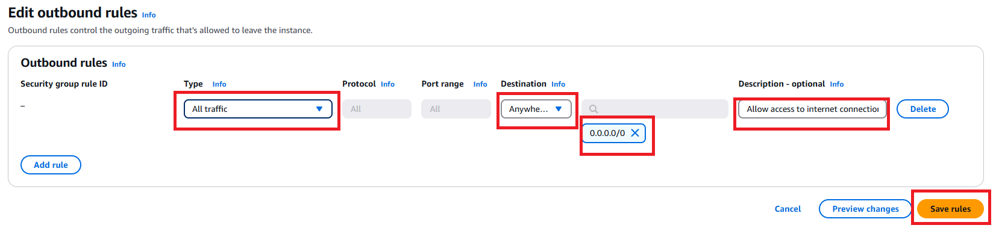

# Servidor Wordpress (docker) + Amazon EC2 + Amazon RDS + CloudWatch

## #Objetivo do Projeto
Criar uma VPC e instâncias EC2 Ubuntu, instalar o docker e subir containers do Wordpress nas instâncias usando o RDS (como banco de dados), montar um diretório com Amazon EFS para usar como volume do container, criar um Auto-Scaling Group (para criar ou remover instâncias conforme o tráfego), um Load Balancer (para distribuir o tráfego entre os servidores), e configurar o Amazon CloudWatch para monitorar as intâncias EC2.

## #Tecnologias utilizadas
> É necessário possuir: uma conta na Amazon AWS e no Discord e o VSCODE instalado na máquina.

- Sistema Operacional da máquina utilizado durante o projeto: Windows 11.
- Recursos Amazon AWS: VPC, Security Group, Subnets, Key Pair, Instance EC2 (Amazon Linux 2023 AMI, t2.micro), RDS, CloudWatch.
- Docker e Docker Compose.
- VSCode (GitBash - terminal).

### 1. Criando um container Wordpress local
> Para esse laboratório, já foram previamente instalados: Docker Desktop (v4.39.0) - com o  integração do WSL habilitada, WSL (v2.4.11.0) - com um subsistema Ubuntu (v24.04).

* Abrir o terminal do Ubuntu e digitar:

<a href="local/docker-compose.yml">docker-compose</a>

<a href="local/.env">env</a>

```
sudo su -
(inserir sua senha de root)
apt update && apt upgrade -y
cd /
mkdir wordpress && cd wordpress
mkdir compose && cd compose
vi docker-compose.yml
(colar código docker-compose.yml aqui, salvar e sair)
vi .env
(colar código .env aqui, salvar e sair)
docker-compose up -d
```

*Acessar http://ip_maquina_linux:8080 no navegador para acessar o wordpress.
> Para vizualizar o ip da sua máquina, execute o comando: ip a (copiar o ip do tipo "BROADCAST,MULTICAST,UP" - geralmente o nome da interface é ***eth0***).

</img>

### 2. Criando a VPC 

2.1 Procurar e selecionar ***VPC*** no console da Amazon AWS.
> A Amazon Virtual Private Cloud (VPC) é uma rede virtual isolada que possibilita usar recursos AWS nela, como as instâncias EC2.


2.2 Selecionar ***Create VPC***.


2.3 Selecionar ***VPC and More***; habilitar Auto-generate e inserir o nome de sua VPC; Number of public subnets: 2 (quantidade de subnets públicas da VPC); Number of private subnets: 2 (quantidade de subnets privadas da VPC); selecionar ***In 1 AZ*** e ***Create VPC***.
> As demais configurações não alteramos.


> O security group define o tráfego dos nossos recursos AWS (quem e quais conexões e portas são permitidas, similiar a um firewall).

### 3. Criando o Security Group das instâncias EC2, e da instância RDS (MySQL) e do sistema de arquivos (EFS), balanceador de carga (CLB)
> O security group define o tráfego dos nossos recursos AWS (quem e quais conexões e portas são permitidas, similiar a um firewall).

3.1 Procurar e selecionar ***EC2*** no console da AWS.


3.2 Selecionar ***Security Groups***. 


3.3 Selecionar ***Create security group***.
> Criando Security Group das instâncias EC2 (Wordpress).


3.4 Informar o nome do seu Security Group em Security group name; inserir a descrição do seu Security Group em Description; selecionar a VPC que foi criada anteriormente.



3.5 Selecionar ***Delete*** (Outbound Rules).


3.6 Selecionar ***Create security group***.


3.7 Selecionar ***Create security group***.
> Criando o security group do MySQL (RDS).


3.8 Informar o nome do seu Security Group em Security group name; inserir a descrição do seu Security Group em Description; selecionar a VPC que foi criada anteriormente.


3.9 Selecionar ***Delete*** (Outbound Rules).


3.10 Selecionar ***Create security group***.


3.11 Selecionar: ***Inbound rules***; ***Edit Inbound Rules***.



3.12 Selecionar ***Add rule***, e inserir: Type: MYSQL/Aurora; Source: Custom - selecionar o security group das intâncias EC2; Description: a descrição da sua regra MySQL.
> Essa regra de entrada vai permitir o acesso das instâncias Wordpress com a instâncias RDS(banco de dados) que criaremos.

3.13 Selecionar ***Save rules***.


3.14 Selecionar ***Create security group***.
> Criando o security group do sistema de arquivos (EFS).


3.15 Informar o nome do seu Security Group em Security group name; inserir a descrição do seu Security Group em Description; selecionar a VPC que foi criada anteriormente.


3.16 Selecionar ***Delete*** (Outbound Rules).


3.17 Selecionar ***Create security group***.


3.17 Selecionar: ***Inbound rules***; ***Edit Inbound Rules***.


3.19 Selecionar ***Add rule***, e inserir: Type: NFS; Source: Custom; Description: a descrição da sua regra NFS.
> Essa regra de entrada vai permitir o acesso das instâncias EC2 com o sistema de arquivos (EFS). 

3.20 Selecionar ***Save rules***.


3.21 Selecionar ***Create security group***.
> Criando o security group do balanceador de carga (Classic Load Balancer).


3.22 Informar o nome do seu Security Group em Security group name; inserir a descrição do seu Security Group em Description; selecionar a VPC que foi criada anteriormente.

 

3.23 Selecionar ***Delete*** (Outbound Rules).


3.24 Selecionar ***Create security group***.


3.25 Selecionar: ***Inbound rules***; ***Edit Inbound Rules***.


3.26 Selecionar ***Add rule***, e inserir:  Type: HTTP; Source: Anywhere ipv4; Description: a descrição da sua regra clb.
> Essa regra de entrada vai permitir o acesso HTTP de qualquer máquina com o nosso balanceador de carga.

3.27 Selecionar ***Save rules***.


3.28 Selecionar: ***Outbound rules***; ***Edit Outbound Rules***.



3.29 Selecionar ***Add rule***, e inserir: Type: HTTP; Destination: Custom - selecionar o security group das instâncias ec2; Description: a descrição da sua regra de saída.
> Essa regra de saída vai permitir que o load balancer crie a conexão entre a rede externa com os servidores Wordpress.

3.30 Selecionar ***Save rules***. -->


3.31 Selecionar ***Security Groups***. 


3.32 Selecionar security group das instâncias EC2.


3.33 Selecionar: ***Inbound rules***; ***Edit Inbound Rules***.


3.34 Selecionar ***Add rule***, e inserir:  Type: HTTP; Source: Custom - security group do load balancer; Description: a descrição da sua regra de entrada.
> Essa regra de entrada vai permitir o acesso HTTP do load balancer com as instâncias Wordpress. 

3.35 Selecionar ***Save rules***.



3.36 Selecionar: ***Outbound rules***; ***Edit Outbound Rules***.


3.37 Selecionar ***Add rule***, e inserir: Type: All traffic; Destination: Anywhere-IPv4; Description: a descrição da sua regra de saída.
> Essa regra de saída vai permitir que a instância EC2 que criaremos possa se conectar com a internet.

3.38 Selecionar ***Save rules***.



editar sgec2 wordpress
### 4. Criando a instância RDS
> O Amazon Relational Database Service (Amazon RDS) é um serviço da Web que facilita a configuração, a operação e escalabilidade de um banco de dados relacional na Nuvem AWS.

4.1 Procurar e selecionar ***RDS*** no console da AWS.

</img>

4.2 Selecionar ***Databases*** e ***Create database***.

</img>

</img>

4.3 Selecionar ***Standard create*** e ***MySQL***.

</img>

4.4 Selecionar ***Free tier*** e ***Single-AZ DB instance deployment (1 instance)***.

</img>

4.5 Inserir o nome da instância RDS e nome do usuário do banco; selecionar ***Self managed***; inserir senha do usuário (a senha não pode conter caracteres especiais) e redigitá-la.
> Guarde as credenciais do usuário em um local seguro.

</img>

4.6 Selecionar ***db.t3.micro*** e inserir 20 (Allocated Storage).

</img>

4.7 Selecionar ***Additional storage configuration***; desabilitar ***Enable storage autoscaling***; selecionar: ***Don’t connect to an EC2 compute resource***, a vpc que criamos e ***No***(Public access).

</img>

4.8 Selecionar: ***Choose existing***; o security group do database que foi criado (apenas ele deve estar habilitado); e ***No preference***(Availability Zone). 

</img>

4.9 Selecionar ***Password authentication*** e ***Database Insights - Standard***.

</img>

4.10 Selecionar ***Additional configuration***; inserir nome do banco de dados; desabilitar ***Enable automated backups***, habilitar ***Enable auto minor version upgrade***.

</img>

4.11 Desabilitar ***Enable auto minor version upgrade*** e ***Enable deletion protection***; selecionar ***No preference*** e ***Create database***.

</img>

4.12 Selecionar ***Close***.

</img>

4.13 Selecionar a instância RDS.
> O status da instância precisa ser igual a "Available" (é necessário aguardar alguns minutos e selecionar o botão "Refresh" para atualizar a página).

</img>

4.14 Selecionar ***Connectivity & security*** e copiar o endpoint do banco de dados.
> Usaremos o endereço do endpoint do banco de dados para realizar a conexão entre as instâncias WordPress com o MySQL(dentro da variavel WORDPRESS_DB_HOST do arquivo "docker-compose.yml").

</img>

### 5. Criando um sistema de arquivo (EFS)
> O Amazon EFS fornece armazenamento de arquivos escalável para uso com o Amazon EC2. É possível usar um sistema de arquivos de EFS como uma fonte de dados comum para workloads e aplicações em execução em várias instâncias.

5.1 Procurar e selecionar ***EFS*** no console da AWS.

</img>

5.2 Selecionar ***Create file system*** e ***Customize***.

</img>

</img>

5.3 Inserir nome do sistema de arquivos; selecionar ***Regional***; desabilitar enable automatic backups; selecionar ***None*** (para todas opções do campo Lifecycle management); habilitar ***Enable encryption of data at rest***.  

</img>

5.4 Selecionar ***Bursting*** e ***Next***.

</img>

5.5 Selecionar a VPC que criamos.

5.6 Selecionar: Availability zone: 1a; subnet privada 1; e o security group do efs.

5.7 Selecionar: Availability zone: 1b; subnet privada 2; e o security group do efs.

</img>

5.8 Selecionar ***Next***, ***Next*** e ***Create***.
> As configurações feitas nos tópicos 5.6 e 5.7 permitirão montarmos o sistema de arquivos dentro das instâncias Wordpress.

5.9 Selecionar o File System criado.
> O status do file system precisa ser igual a "Available" (é necessário aguardar alguns minutos e selecionar o botão "Refresh" para atualizar a página).

</img>

5.10 Selecionar ***Attach***.

</img>

5.11 Selecionar ***Mount via DNS***, copiar o comando (EFS mount helper).
> Esse comando será usado para montar o sistema de arquivos que criamos dentro das instâncias EC2.

</img>

### 6. Criando o Launch Template Wordpress
> Launch template é basicamente um modelo pronto usado para criar instâncias EC2.

6.1 Procurar e selecionar ***EC2*** no console da AWS.


6.2 Selecionar ***Launch Template*** e ***Create Launch Template***.


6.3 Inserir o nome do launch template e sua descrição, habilitar "Provide guidance...".


6.4 Selecionar: Quick Start: Amazon Linux (é o sistema operacional do servidor); AMI: Amazon Linux AMI; Architeture: 64 bits ou 32 bits; Instance Type: t2.micro (é o tipo da instância).


6.5 Selecionar ***Select existing security group*** e o security group das instâncias.
tp4

6.6 Selecionar ***Advanced Details***.
        


<a href="./userdata/user-data.sh">código user data</a>
    
6.7 Selecionar ***Choose file*** (e selecionar seu script de automatização) ou colar na caixa de texto o script e ***Create launch template***.


### 7. Criando o balanceador de carga

7.1 Procurar e selecionar ***EC2*** no console da AWS.


7.2 Selecionar ***Load Balancers*** e ***Create load balancer***.


7.3 Selecionar ***Classic Load Balancer - previous generation*** e ***Create***.


7.4 Inserir nome do CLB (classic load balancer); selecionar ***Internet Facing*** e a Vpc que criamos para o laboratório.


7.5 Habilitar todas as AZs disponíveis (1-a e 1-b) e selecionar as subnets públicas 1 e 2.


7.6 Selecionar o security group do clb e inserir o caminho do health check: `/wp-admin/install.php.`


7.7 Selecionar ***Create load balancer***.


7.8 Copiar o DNS do clb.
> Usaremos o dns em breve para acessarmos no navegador as instâncias wordpress.


### 8. Criando o Auto Scaling Group

8.1 Procurar e selecionar ***EC2*** no console da AWS.


8.2 Selecionar ***Auto Scaling Groups*** e ***Create Auto Scaling Group***.


8.3 Inserir nome do auto scaling group; selecionar template criado anteriormente,  ***Latest*** e ***Next***.


8.4 Selecionar Vpc criada anteriormente, as subnetes privadas (1-a e 1-b), ***Balanced best effort*** e ***Next***. 


8.5 Selecionar ***Attach to an existing load balancer***, ***Choose from Classic Load Balancers*** e o clb criado.


8.6 Habilitar "Turn on Elastic Load Balancing health checks" e selecionar ***Next***.


* Após criar o auto scaling group e vinculá-lo ao load balancer, podemos perceber que 2 instâncias foram criadas (mínimo conforme nosso auto scaling group) e em diferentes zonas de disponibilidade e subnet (conforme foi configurado o clb).


* E as subnets das instâncias wordpress são privadas conforme a configuração do auto scaling group.


### 9. Criando política de monitoramento do CloudWatch para monitorar as instâncias Wordpress

9.1 Procurar e selecionar ***EC2*** no console da AWS.


9.2 Selecionar ***Auto Scaling Groups*** e o auto scaling group criado.


9.3 Selecionar ***Automatic scaling*** e ***Create dynamic scaling policy***.


9.4 Policy type: Simple Scaling; inserir nome da politíca de scaling; add 1 capacity units; selecionar ***Create***.
> Essa política vai adicionar uma instancia ao auto scaling group.


9.5 Procurar e selecionar ***CloudWatch***.


9.6 Selecionar ***Alarms***, ***In alarm***, ***Create alarm*** e ***Select Metric***.

9.7 Selecionar ***EC2***, ***By Auto Scaling Group***.

9.8 Selecionar métrica de utilização de processador e ***Select metric***.

9.9 Greather than 94, selecionar ***Next***.

9.10 Selecionar ***Remove***(Notification).

9.11 Selecionar ***Add Auto Scaling action***; ***In alarm***; ***EC2 Auto Scaling group***; selecionar o grupo de auto scaling criado anteriormente e ***Next***.


9.12 Inserir nome do alarme CloudWatch e selecionar 2X ***Next*** e selecionar ***Create alarm***.

9.13 Selecionar o ícone do power shell e executar o comando `aws cloudwatch set-alarm-state --alarm-name "nome_alarme" --state-value ALARM --state-reason "motivo_teste"`.
> Esse comando força o CloudWatch disparar o alarme (indepedente se a métrica esteja sendo atendida, como consequencia o auto scaling group executará a ação configurada na política personalizada).


* O alarme foi disparado:


* Uma terceira instância foi criada e esta sendo inicializada, conforme a política de scaling.


### 10. Teste final - acessando o Wordpress pelo DNS do CLB

* Copiar e colar DNS do load balance no navegador.

</img>

* Criando um usuário do Wordpress e instalando o Wordpress.

</img>

</img>

</img>

</img>